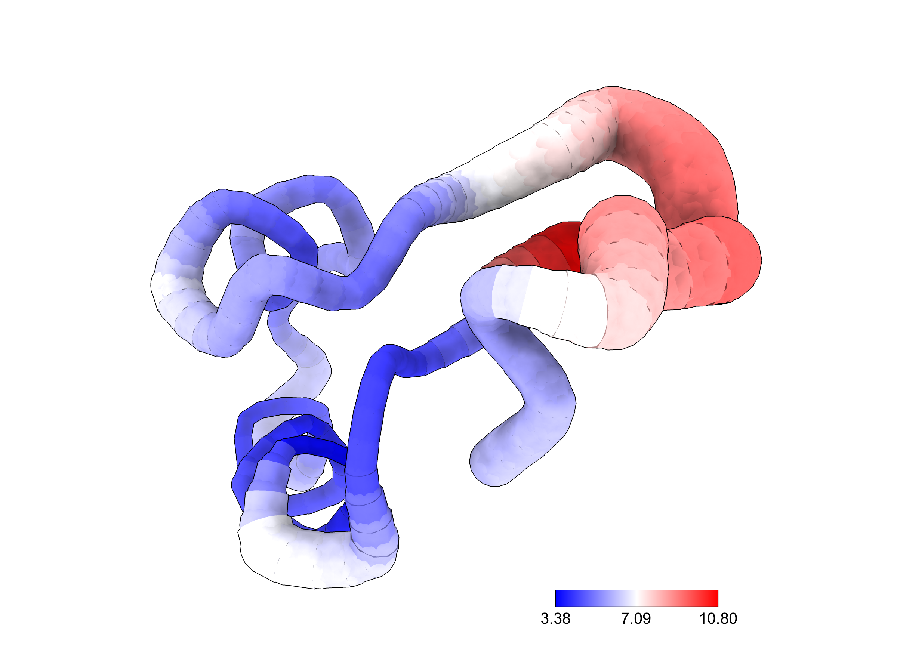
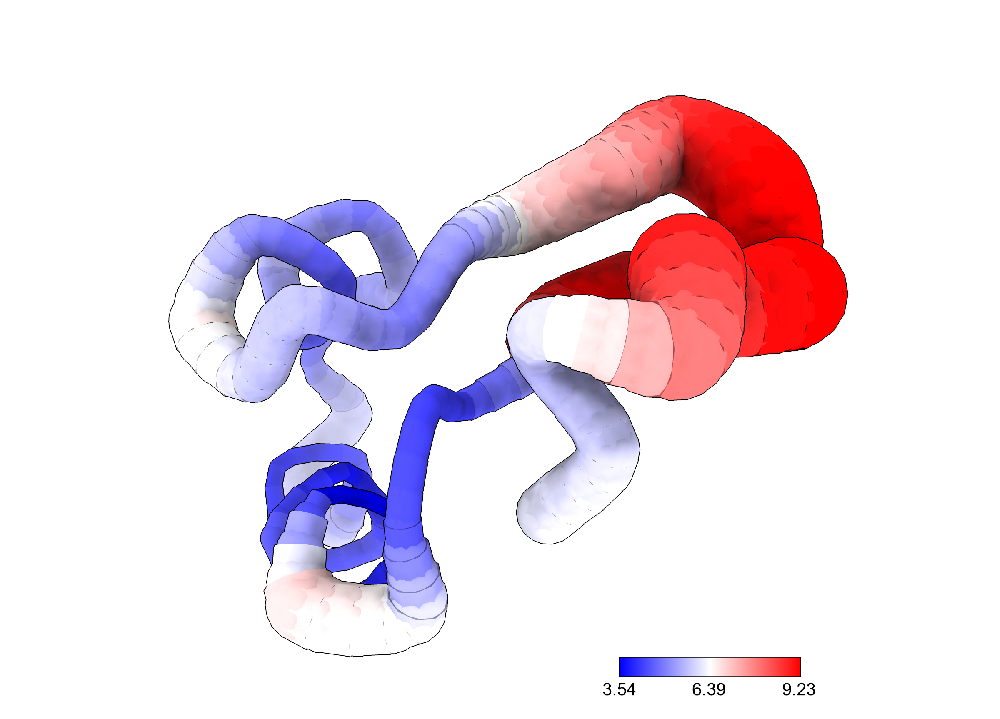
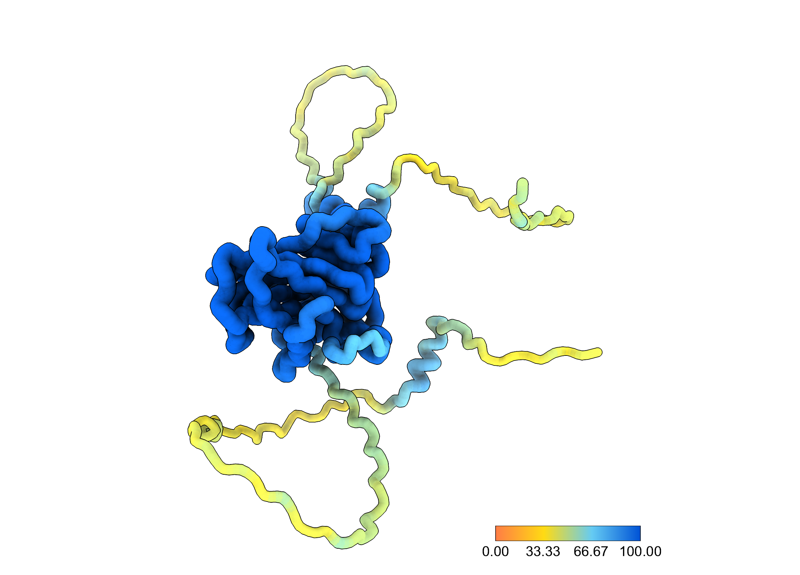

# noodleX

A B-factor "putty" (worm) representation for UCSF ChimeraX — the same idea
as PyMOL's `cartoon putty`: a backbone tube whose radius *and* color track
a per-residue scalar value (by default, the B-factor column of the input
PDB).

Sibling project to [porcupineX](https://github.com/lucasabrdiniz/porcupineX):
same philosophy, single Python script, no ChimeraX bundle/plugin install —
it emits a plain `.bild` file (native ChimeraX primitives:
`.sphere` / `.cylinder`) that you just `open` in ChimeraX.

## Gallery

| Default (blue:white:red) | `--clip-percentile 5,95` | `--palette alphafold` |
|---|---|---|
|  |  |  |
| Crambin (1CRN), raw B-factor min/max. | Same structure/data, range clipped to the 5th/95th percentiles instead of raw min/max — the single-residue outlier at the N-terminus no longer swallows the whole scale. | Real AlphaFold model (human p53, [AF-P04637](https://alphafold.ebi.ac.uk/entry/P04637)) — the folded DNA-binding domain is thick/blue (high confidence), the intrinsically disordered tails are thin/orange (low confidence). |

Regenerate these with `python3 example/gallery/build_gallery.py` (see the script for the exact `noodle_bild()` calls behind each one).

## Why not just use ChimeraX's native `worm` command?

ChimeraX 1.8+ already ships `worm` / `cartoon byattribute`, which does the
same linear B-factor → radius mapping natively:
```
worm bfactor #1
color byattribute bfactor #1 palette blue:white:red
```
If you're working interactively and have ChimeraX 1.8+, that's less typing
and probably what you want.

noodleX exists for the cases where that isn't enough:
- **no version dependency** — works on any ChimeraX (or Chimera classic)
  that can open a `.bild` file, not just 1.8+;
- **no install step** — drops straight into a scripted/batch pipeline
  (e.g. generating figures for many structures without ever opening the
  ChimeraX GUI);
- **hackable mapping** — the value→radius/color curve is a few lines of
  Python you can edit directly, instead of being locked to the built-in
  command's behavior.

## Requirements

- Python 3
- [NumPy](https://numpy.org/)
- [MDAnalysis](https://www.mdanalysis.org/)
- matplotlib (+ optionally seaborn) — only needed for `--plot`

```
pip install numpy MDAnalysis matplotlib seaborn
```

## Usage

```
python3 noodlex.py input.pdb output.bild [options]
```

Then in ChimeraX:
```
open input.pdb
hide atoms
open output.bild
```

### Example

```
python3 noodlex.py example/1crn.pdb example/1crn_noodle.bild \
    --csv example/1crn_values.csv \
    --plot example/1crn_profile.png \
    --label-top 3
```

### Options

| Flag | Default | Description |
|---|---|---|
| `--atom` | `CA` | backbone atom to trace |
| `--chain` | all | comma-separated chain IDs to include |
| `--frame` | `0` | model/frame index to read |
| `--scale-min` | `0.3` | tube radius (Å) at the lowest value |
| `--scale-max` | `2.0` | tube radius (Å) at the highest value |
| `--value-min` / `--value-max` | data min/max | fix the value range instead of deriving it from the structure (useful to keep multiple renders on the same color/radius scale) |
| `--clip-percentile LOW,HIGH` | off | derive the value range from data percentiles (e.g. `5,95`) instead of raw min/max — robust to a single outlier residue stretching the whole scale thin. Ignored for an axis where `--value-min`/`--value-max` is also given. |
| `--palette` | `blue:white:red` | `:`-separated color stops, each a name, `#rrggbb`, or `r,g,b`; or the preset `alphafold` (pLDDT-style orange→yellow→cyan→blue, and auto-sets the value range to 0-100 unless you override it) |
| `--smooth` | `4` | centripetal Catmull-Rom spline subdivisions per residue-residue segment; `1` disables smoothing |
| `--legend` | off | append a straight color/radius reference bar to the `.bild` (unlabeled -- prefer `--open` for a real labeled key instead) |
| `--open` | off | write a companion `<bild>_view.cxc` (structure + tube + a labeled `key` legend) and launch ChimeraX with it |
| `--csv` | — | write a per-residue value/radius table |
| `--plot` | — | write a PNG profile plot (value vs. residue) |
| `--label-top N` | `0` | annotate the N highest-value residues on `--plot` |

### Seeing it directly (`--open`)

```
python3 noodlex.py example/1crn.pdb example/1crn_noodle.bild --open
```
This launches ChimeraX (auto-detected: `$CHIMERAX_APP`, `/Applications/ChimeraX*.app` on macOS, or `chimerax`/`ChimeraX` on PATH) with the structure, the tube, and an on-screen labeled color key. If ChimeraX can't be found automatically, the `.cxc` path is printed so you can open it yourself (`open -a ChimeraX <path>` or `chimerax <path>`).

## How it works

1. Reads the chosen backbone atom (default Cα) and its B-factor
   (`tempfactor`) per residue via MDAnalysis, split into chains and further
   split at any residue-numbering gap (so the tube never bridges a chain
   break).
2. Each contiguous run is smoothed with a centripetal Catmull-Rom spline
   (`--smooth`) so the tube isn't visibly faceted at every residue, and
   doesn't loop/overshoot at sharp turns the way a plain uniform
   Catmull-Rom would.
3. The value range (data min/max, `--clip-percentile`, or explicit
   `--value-min`/`--value-max`) maps every spline point's value to a
   radius (`--scale-min`/`--scale-max`) and color (`--palette`).
4. Each run is written to `.bild` as a chain of `.sphere` joints +
   `.cylinder` segments (spheres cover the seams at bends).
5. With `--legend`, a straight reference bar using the same primitives is
   appended next to the structure, sweeping the same radius/color range.
   It's off by default and has no numeric labels — BILD has no reliable
   3D text primitive, so it read more like a stray cone than a legend.
   For readable min/max labels, use `--open` instead, which adds
   ChimeraX's own native `key` legend (a proper 2D overlay with numbers).

## License

MIT — see [LICENSE](LICENSE).
